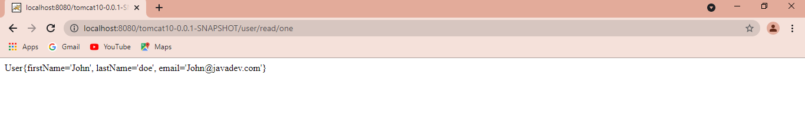

### Deploy a Spring Boot REST app as a WAR to Tomcat 10

### Introduction:
In this tutorial, the reader will learn to deploy a `Spring Boot REST` app to `Tomcat 10`. According to [Apache](https://tomcat.apache.org/index.html) the Jakarta EE platform is the evolution for the Java EE platform. Tomcat 10 and later implement specifications developed as part of Jakarta EE. Tomcat 9 and earlier implement specifications developed as part of Java EE.
Due to this reason applications developed for Tomcat 9 and earlier will not run on Tomcat 10 and this application will leverage a simple user object to demonstrate how Java EE applications can be deployed on Tomcat 10.

### Requirements:
- Java 11+
- Maven
- Tomcat 10
- Intellij (optional)

### Tomcat Installation:
Use the following link to download Tomcat 10.
- [Tomcat 10 Download](https://tomcat.apache.org/download-10.cgi)

For windows users, add the following to the environment variables named `CATALINA_HOME`.
- `C:\Program Files\Apache Software Foundation\Tomcat 10.0`

To run tomcat run the following command on windows command prompt.
```console
startup
```
If the configurations are correct the following will be the output after starting tomcat.
```console
C:\Users\david>startup
Using CATALINA_BASE:   "C:\Program Files\Apache Software Foundation\Tomcat 10.0"
Using CATALINA_HOME:   "C:\Program Files\Apache Software Foundation\Tomcat 10.0"
Using CATALINA_TMPDIR: "C:\Program Files\Apache Software Foundation\Tomcat 10.0\temp"
Using JRE_HOME:        "C:\Program Files\Java\jdk-11.0.10"
Using CLASSPATH:       "C:\Program Files\Apache Software Foundation\Tomcat 10.0\bin\bootstrap.jar;C:\Program Files\Apache Software Foundation\Tomcat 10.0\bin\tomcat-juli.jar"
Using CATALINA_OPTS:   ""
C:\Users\david>

```
### Creating a Spring Boot Application.
Navigate to [Spring Initializr](https://start.spring.io/) and create a new project with the dependencies shown below. Extract the generated zip folder and import the project to Intellij or your preferred IDE.

Set the packaging type to war.
```XML
<packaging>war</packaging>
```
Since we are going to use an external Tomcat, add `provided` tag to tomcat dependecy in `pom.xml`.
```xml
<dependency>
    <groupId>org.springframework.boot</groupId>
    <artifactId>spring-boot-starter-tomcat</artifactId>
    <scope>provided</scope>
</dependency>
```
In the main application `extend SpringBootServletInitializer` and `@Override configure` method to enable us to run the application from Tomcat the classical way.
```java
import org.springframework.boot.SpringApplication;
import org.springframework.boot.autoconfigure.SpringBootApplication;
import org.springframework.boot.builder.SpringApplicationBuilder;
import org.springframework.boot.web.servlet.support.SpringBootServletInitializer;

@SpringBootApplication
public class Tomcat10Application extends SpringBootServletInitializer {

    public static void main(String[] args) {
        SpringApplication.run(Tomcat10Application.class, args);
    }

    @Override
    protected SpringApplicationBuilder configure(SpringApplicationBuilder builder) {
        return builder.sources(Tomcat10Application.class);
    }
}
```
### Create a User model
Create a class named `User` in a package called model with the following fields.
- firstName
- lastName
- email
```java
public class User {
    private String firstName;
    private String lastName;
    private String email;

    public User(String firstName, String lastName, String email) {
        this.firstName = firstName;
        this.lastName = lastName;
        this.email = email;
    }
    // Generate toString method
}
```
### Create a User Controller:
Create a class named `UserController` in a packed called controller and create a user objct which will be returned when a user issues the following request.
- `/user/read/one`
```java
import org.springframework.web.bind.annotation.GetMapping;
import org.springframework.web.bind.annotation.RequestMapping;
import org.springframework.web.bind.annotation.RestController;

@RestController
@RequestMapping("/user")
public class UserController {

    @GetMapping("/read/one")
    public String readUser(){
        User user = new User("John","doe","John@javadev.com");

        return user.toString();
    }
}
```
### Deploying the application on Tomcat
Navigate to Tomcat and create a folder named `webapps-javaee`.
 
In a command prompt, navigate to your project source and generate a `war` file using the following command.
```console
mvnw verify
```
Add the genarated war file to `webapps-javaee` folder.

Restart Tomcat and note the following logs on server startup.
Alternatively the application can be migrated using the following command.
- `java -jar jakartaee-migration-*-shaded.jar <source> <destination>`


Once you restart the server, Tomcat will migrate the application automatically and add it to `webapps` folder under Tomcat installation.
 
On your preferred browser issue the following link which will return a user object that was created in the controller.
- `http://localhost:8080/tomcat10-0.0.1-SNAPSHOT/user/read/one`



### Conclution:
In this tutorial, you have learned how to deploy a Spring Boot REST application to Tomcat 10 by leveraging the default functionality provided by Tomcat 10 to migrate Java EE applications. You have observed how Tomcat 10 migrates the application behind the scene and generates an application that can be run on Tomcat 10.

Happy coding!


